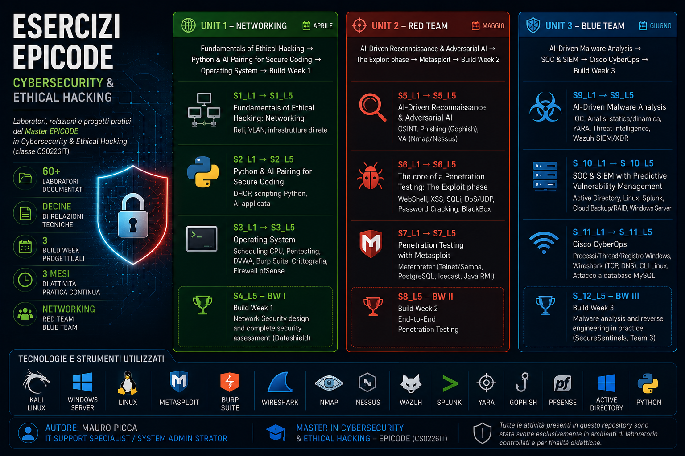

<h1 align="center">Esercizi EPICODE — Cybersecurity & Ethical Hacking</h1>

  

  <strong style="font-size:1.2em">Mauro Picca</strong> — IT Support Specialist | System Administrator

  🎓 Master in Cybersecurity & Ethical Hacking – EPICODE (CS0226IT)

  <a href="https://www.linkedin.com/in/mauro-picca">🔗 LinkedIn</a>

---

> Oltre 60 laboratori, relazioni tecniche e progetti pratici realizzati durante il Master EPICODE in Cybersecurity & Ethical Hacking (classe CS0226IT).

Questo repository raccoglie le relazioni, i laboratori e i progetti sviluppati durante il percorso formativo presso **EPICODE Institute of Technology**.

Non è soltanto un archivio di esercitazioni, ma un portfolio tecnico che documenta l'intero percorso di apprendimento: settimana dopo settimana vengono illustrate le attività svolte, le metodologie adottate, gli strumenti utilizzati e i risultati ottenuti, dalle basi del networking fino alle attività di Red Team e Blue Team.

Ogni cartella rappresenta una settimana (`S`) e un laboratorio (`L`) del master e contiene la documentazione tecnica delle esercitazioni svolte, con procedure, evidenze, screenshot e conclusioni.

---

<h1 align="center">📊 Il percorso in numeri</h1>

| 📁 | 📝 | 🛡️ | 🌐 | 📅 |
|:---:|:---:|:---:|:---:|:---:|
| **60+** Laboratori documentati | **Decine** di relazioni tecniche | **3** Build Week progettuali | **3** Aree: Networking, Red Team, Blue Team | **3 mesi** di attività pratica continuativa |

---

<h1 align="center">🎯 Competenze sviluppate</h1>

| | | |
|---|---|---|
| Network Security | Vulnerability Assessment | Penetration Testing |
| Web Application Security | Malware Analysis | Threat Intelligence |
| SIEM & Log Analysis | Incident Detection | Windows Server & Active Directory |
| Linux Administration | Network Traffic Analysis | Scripting con Python |

---

<h1 align="center">📁 Struttura del repository</h1>

L'intero percorso è organizzato in **tre Unit didattiche**, ciascuna conclusa da una **Build Week** dedicata allo sviluppo di un progetto pratico.

---

<h2 align="center">🌐 UNIT 1 — Networking <em>(aprile)</em></h2>

<strong>Fundamentals of Ethical Hacking → Python & AI Pairing for Secure Coding → Operating System → Build Week 1</strong>

| Cartella | Contenuti |
|----------|-----------|
| `Precorso` | Materiale introduttivo e propedeutico |
| `S1_L1 → S1_L5` | Fondamenti di networking, VLAN, infrastrutture di rete |
| `S2_L1 → S2_L5` | DHCP, scripting Python e AI applicata alla sicurezza |
| `S3_L1 → S3_L5` | Sistemi Operativi, CPU Scheduling, DVWA, Burp Suite, Crittografia, pfSense |
| `S4_L5 - BW I` | **Build Week 1** – Progetto completo di Network Security Assessment (Datashield) |

---

<h2 align="center">🎯 UNIT 2 — Red Team <em>(maggio)</em></h2>

<strong>AI-Driven Reconnaissance → Exploitation → Metasploit → Build Week 2</strong>

| Cartella | Contenuti |
|----------|-----------|
| `S5_L1 → S5_L5` | OSINT, AI Reconnaissance, Vulnerability Assessment (Nmap/Nessus), Gophish |
| `S6_L1 → S6_L5` | WebShell, XSS, SQL Injection, Password Cracking, DoS, BlackBox Testing |
| `S7_L1 → S7_L5` | Metasploit Framework, Meterpreter, sfruttamento di vulnerabilità reali |
| `S8_L5 - BW II` | **Build Week 2** – End-to-End Penetration Testing |

---

<h2 align="center">🛡️ UNIT 3 — Blue Team <em>(giugno)</em></h2>

<strong>Malware Analysis → SOC & SIEM → Cisco CyberOps → Build Week 3</strong>

| Cartella | Contenuti |
|----------|-----------|
| `S9_L1 → S9_L5` | Malware Analysis, IOC, YARA, Threat Intelligence, Wazuh SIEM/XDR |
| `S_10_L1 → S_10_L5` | Active Directory, Linux, Splunk, Cloud Backup, Windows Server |
| `S_11_L1 → S_11_L5` | Cisco CyberOps, Wireshark, Analisi TCP/DNS, Linux CLI, MySQL Security |
| `S_12_L5 - BW III` | **Build Week 3** – Malware Analysis & Reverse Engineering (SecureSentinels - Team 3) |

---

<h1 align="center">🛠️ Tecnologie e strumenti</h1>

<strong>Operating Systems</strong>

Kali Linux · Windows Server · Linux

<strong>Security</strong>

Metasploit · Burp Suite · Nmap · Nessus · Wazuh · Splunk · YARA · Gophish

<strong>Networking</strong>

Wireshark · pfSense · Active Directory

<strong>Programming</strong>

Python

---

> **Nota**
>
> Tutte le attività presenti in questo repository sono state svolte esclusivamente in ambienti di laboratorio controllati e per finalità didattiche durante il Master EPICODE in Cybersecurity & Ethical Hacking.
